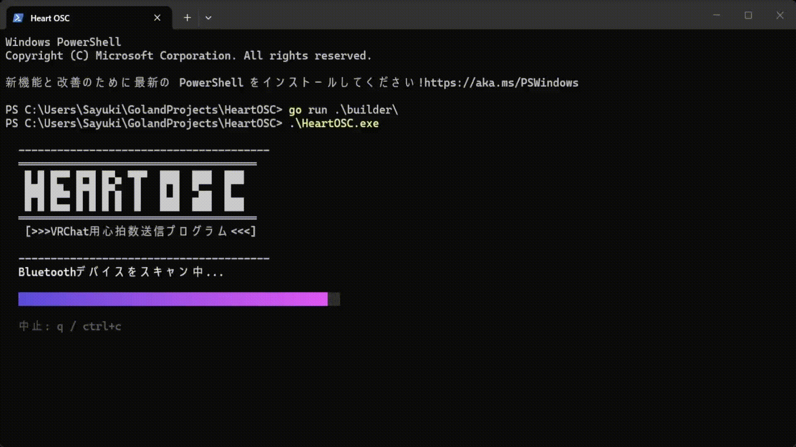

# HeartOSC
[](LICENSE)

KISS（Keep It Simple, Stupid.）原則を従った
BLE（Bluetooth Low Energy）対応心拍計を
VRChatと連動させるための極めて軽量でシンプルなOSC送信用TUIプログラム。

## ダウンロード

お使いのOSやプラットフォームに従って選んでください、通常は`HeartOSC_windows_amd64.zip`でおけです。

| OS      | x86_64 (amd64)                                                                                                          | ARM64                                                                                                                   |
|---------|-------------------------------------------------------------------------------------------------------------------------|-------------------------------------------------------------------------------------------------------------------------|
| Windows | [HeartOSC_windows_amd64.zip](https://github.com/SayukiDev/HeartOSC/releases/latest/download/HeartOSC_windows_amd64.zip) | [HeartOSC_windows_arm64.zip](https://github.com/SayukiDev/HeartOSC/releases/latest/download/HeartOSC_windows_arm64.zip) |
| Linux   | [HeartOSC_linux_amd64.zip](https://github.com/SayukiDev/HeartOSC/releases/latest/download/HeartOSC_linux_amd64.zip)     | [HeartOSC_linux_arm64.zip](https://github.com/SayukiDev/HeartOSC/releases/latest/download/HeartOSC_linux_arm64.zip)     |
| macOS   | なし                                                                                                                      | [HeartOSC_darwin_arm64.zip](https://github.com/SayukiDev/HeartOSC/releases/latest/download/HeartOSC_darwin_arm64.zip)   |

## 使用



1. ファイルを実行する
2. スキャンが終わるのを待つ
3. 心拍系デバイスを選択してエンターキーを押す

## 必須条件

- 心拍計が`Bluetooth Low Energy`の`Heart Rate`サービスに対応されてる必要がある
    - 専用の心拍計ならほとんどBLEに対応されてる。
    - 一部の心拍機能付属されてる腕時計はBLEに対応されてない場合がある
    - 検証済みのデバイス（理論上`BLE`対応であればどのデバイスでも正常に作動する) 
       - Xiaomiスマートバンド10
       - COOSPO H9Z
       - COOSPO HW706
- VRChatのOSC機能がオンである必要がある
- パソコンに`BLE`対応のブルートゥースアダプター（だいたい`BLE`対応されてる）がついてる必要がある

## VRChat側のパラメーター
- デフォルトは`VRCOSC`と同じ`Int`型の`VRCOSC/Heartrate/Value`パラメーターに心拍数が送信される。
  - 設定画面でパラメーターの名前を変更できる。
- 自分で心拍数を使ってギミック作りたい場合はこのパラメーターをお使いください。

## 既存ツールとの違い

必要な機能を最小限に抑えたこととTUIを採用したことでリソースの消費を最小限に抑え、
既存ツールと比べて極めて軽量かつ高効率、例えば心拍数送信用によく使われてる VRCOSC と比べてメモリーの使用量は約1/10くらい。

## ビルド

```shell
go run ./builder/
```
あるいはプラットフォームを指定
```shell
go run ./builder/ windows amd64
```

## ライセンス

本プロジェクトは自由ソフトウェアであり、[GNU一般公衆ライセンス3.0](https://gpl.mhatta.org/gpl.ja.html)を基づき発行しております。
被配布者(ユーザー)には使用の自由・二次開発の自由・二次配布（販売含む）の自由などの自由が保証されます。  
ただし二次配布（配布物に本プロジェクトのコードが含まれてる限り、二次配布と認定されます）
の場合必ず同じ「GNU一般公衆ライセンス3.0」で発行及びオープンソースするよう義務付けられます、
そして二次被配布者には本プロジェクトが被配布者に与えた自由と同じ自由が与えられます、
それらの自由を制限・干渉するあらゆる行為は一切認められません。